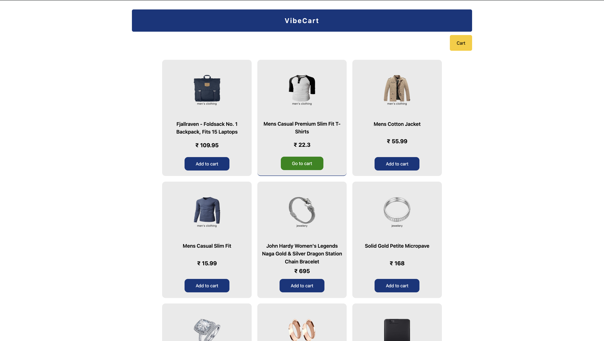

# VibeCart — MERN E-Commerce App  

A simple and elegant e-commerce web app built using the **MERN stack**.  
Users can browse products, add them to the cart, update quantities, and checkout — all with a smooth and clean UI.

---

## Screenshots

### Products Page

### Cart Page

### Checkout Page

##  Demo Video
 [ Watch Demo on Loom](https://www.loom.com/share/dbe5386672ed4071a296f2ebaf5aaad4)

## Tech Stack
- **Frontend:** React, Tailwind CSS, Axios  
- **Backend:** Node.js, Express.js, MongoDB  
- **API Source:** [FakeStore API](https://fakestoreapi.com/) 

---

## Features
✅ Fetch product data from FakeStore API and store it in MongoDB  
✅ Add / Remove products from the cart  
✅ Increase or decrease product quantity  
✅ Checkout and clear cart  
✅ Clean error handling with auto reset  
✅ Fully responsive and minimal UI  

---

## Folder Structure

##  Setup Instructions
1️⃣ Clone Repository
git clone https://github.com/yourusername/vibecart.git
cd vibecart

2️⃣ Setup Backend
cd server
npm install
npm start

3️⃣ Setup Frontend
cd client
npm install
npm run dev

